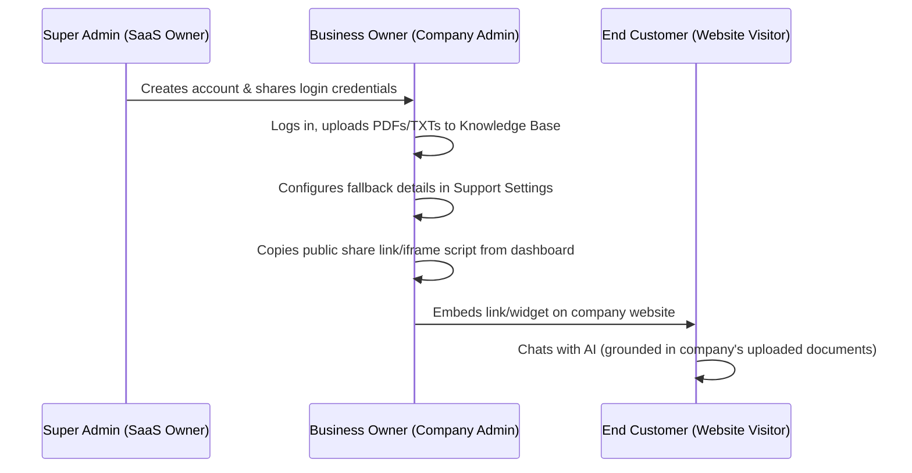

# Production Deployment & SaaS Flow Guide

This document outlines the SaaS application workflow (Super Admin -> Company Admin -> End Customer) and the detailed instructions for deploying the frontend, backend, database, and AI components to production.

---

## 📊 Current Stage & Improvement Backlog

### 🟢 Current Stage: **Production-Ready MVP (Beta)**
* **Multi-Tenant Separation**: Clean, automated workspace (`Company`) provisioning on registration. Database entities (chats, documents, settings) are fully isolated by tenant.
* **AI Engine Stability**: Generative and embedding tasks migrated to `gemini-2.5-flash` and `gemini-embedding-2` with verified streaming citation-grounded responses.
* **Refined Admin Dashboard**: Full control over Knowledge Base files and Brand support fallback details. Improved chat layout to prevent duplicate empty conversation logs and list caching issues.

### 📋 Future Improvements & Backlog
1. **Super Admin Dashboard (Master Panel)**:
   * Build a Master Dashboard for the SaaS Owner to view all companies, manage global system metrics, block accounts, and view overall API usage.
2. **Copyable Chat Embed Snippet**:
   * Add a copyable iframe code or JS script bubble widget inside the **Support Configuration** page. This will let Company Admins embed the chat directly on their business websites.
3. **Team Invitations & RBAC**:
   * Allow Company Admins to invite Team Members (using Roles: `'admin' | 'agent' | 'viewer'`) to collaborate in managing their workspace and viewing chat logs.
4. **SaaS Plans & Manual Billing (Rupees)**:
   * Display subscription tier plans in Rupees (INR / ₹) without complex payment gateways for now. Show a clear instruction on the pricing details: *"To upgrade your plan, please email us at [support_email], and our team will contact you."*
5. **Analytics Insights**:
   * Add charts on the Dashboard showing user satisfaction, popular search keywords, and resolution rates.

---

## 🏗️ SaaS Application Workflow

---

## 🚀 Production Deployment Steps

### 1. Database Setup (MongoDB Atlas)
Your codebase is already configured to work with MongoDB Atlas.
1. Log in to [MongoDB Atlas](https://www.mongodb.com/cloud/atlas).
2. Go to **Network Access** and verify that your server's IP address (or `0.0.0.0/0` temporarily) is whitelisted.
3. Copy your MongoDB connection string (used as `MONGODB_URI` in server environment variables).

---

### 2. Backend API Deployment (Express & Node.js)
You can host the Express server on **Render**, **Railway**, or **AWS EC2**. The instructions below are optimized for **Render**:
1. Log in to [Render](https://render.com).
2. Click **New +** -> **Web Service**.
3. Link your GitHub repository: `PASHOKGITHUB/support-agent`.
4. Configure the settings:
   - **Name**: `support-agent-api`
   - **Root Directory**: `server`
   - **Runtime**: `Node`
   - **Build Command**: `npm install && npm run build`
   - **Start Command**: `npm start`
5. Click **Advanced** and define these **Environment Variables**:
   - `PORT`: `10000`
   - `NODE_ENV`: `production`
   - `JWT_SECRET`: `your_secure_jwt_secret`
   - `MONGODB_URI`: `your_mongodb_atlas_connection_string`
   - `GEMINI_API_KEY`: `your_google_gemini_api_key`
6. Click **Create Web Service**. Render will build and deploy the backend, giving you a public URL (e.g. `https://support-agent-api.onrender.com`).

---

### 3. Frontend Deployment (Next.js)
The frontend is built with Next.js and is best deployed to **Vercel**:
1. Log in to [Vercel](https://vercel.com).
2. Click **Add New** -> **Project**.
3. Import your GitHub repository: `PASHOKGITHUB/support-agent`.
4. Configure the build:
   - **Framework Preset**: `Next.js`
   - **Root Directory**: `client`
5. Under **Environment Variables**, add:
   - `NEXT_PUBLIC_API_URL`: `https://support-agent-api.onrender.com/api` (Point this to your deployed Render URL)
6. Click **Deploy**. Vercel will host the Next.js app and assign a domain (e.g. `https://support-agent.vercel.app`).

---

## 🛠️ Post-Deployment Verification Checklist
- [ ] **Auth**: Sign up a new tenant admin, verify their company is created successfully.
- [ ] **Support Settings**: Modify company name/email and save.
- [ ] **Knowledge Base**: Upload `shipping_policy.txt` and verify status is `Processed`.
- [ ] **AI Assistant**: Query the bot and check that citations from the text file are returned.
